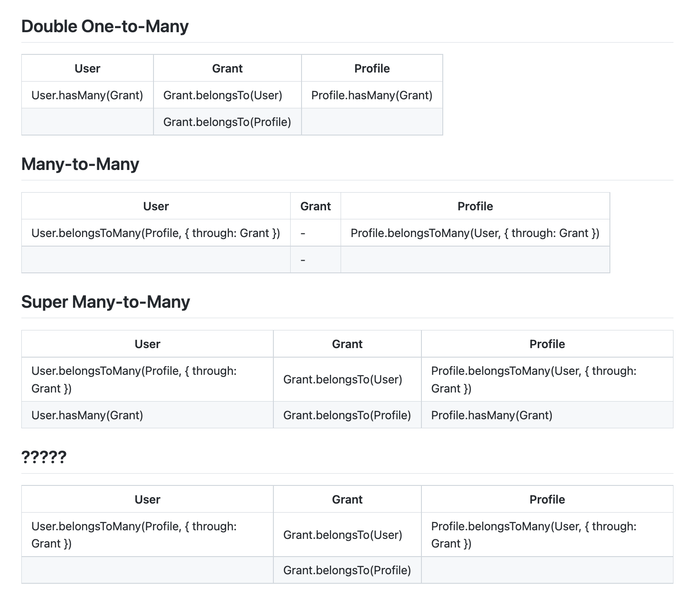
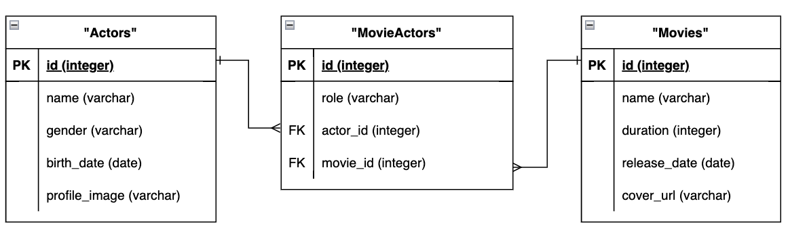
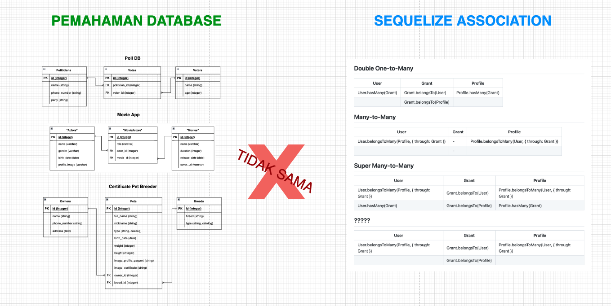

# Lecture Many to Many Sequelize

<h2 style="color:tomato">🦊 Agenda</h2>

1. Many to Many (BASIC DATABASE)
2. Setup Many to Many (SEQUELIZE ASSOCIATION)

- Double One to Many
- Many to Many
- Super Many to Many
- `bisa di custom juga~`

3. Foreign Key

https://gist.github.com/ziterz/a5080149c5a4a4f0e8f5339c16fc90da



<h2 style="color:orange">🦊 Demo</h2>

1. Schema Many to Many
   

2. ~~Migration~~ Review Migration
3. Liat data seeders ada pada `data.json`
4. Create read 1 Movie by ID show detail of movie, actors with their role.
5. Pakai postman

<br></br>
<br></br>
<br></br>
<br></br>

<h2 style="color:orange">🦊 Conclusion</h2>



- Double One to Many

  - nested include

- Many to Many

  - tidak bisa dapat data duplikasi FK yang sama hal ini karena `inner join`
  - tidak bisa join dari juction table, jadi tidak bisa `include`` dari read data junction table

- Super Many to Many
  - recursive.
  - slow read query due to complex query.
  - bisa mendapatkan data duplikasi FK namun bisa saja mendapatkan data yang salah. (able to gey duplicate data **but might able to get wrong data** too `due to recursive join`.)

```diff
-- Be wise, use many to many setup on sequelize  --
--                                               --
-- Setup association sequelize bisa di customize --
```
